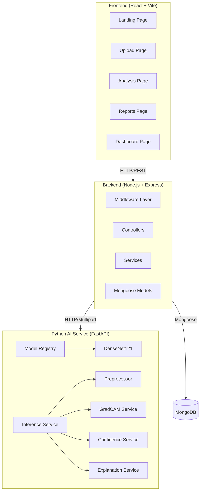
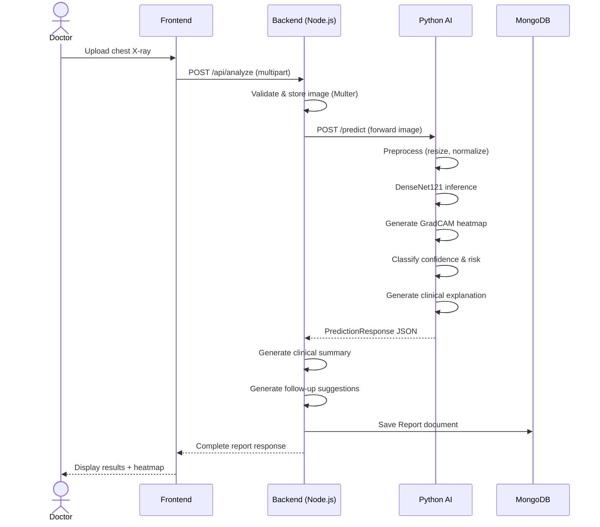
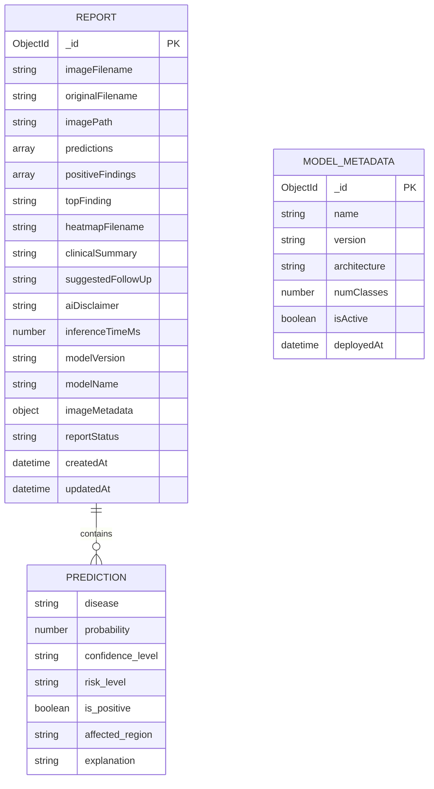
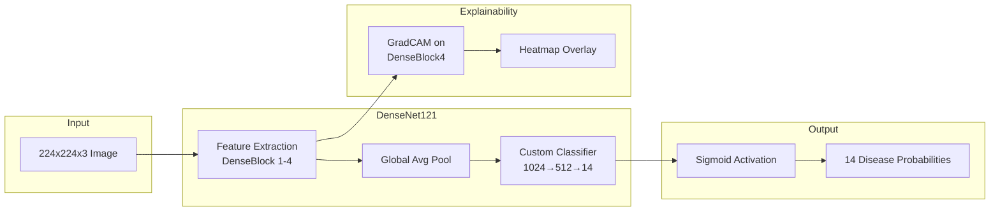

# NEPTUNE-CXR: Architecture Documentation

## System Architecture



## Data Flow: Screening Workflow



## Database Schema (ER Diagram)



## AI Model Architecture



## Folder Structure

```
NEPTUNE-CXR/
├── frontend/           # React + Vite + TailwindCSS
│   ├── src/
│   │   ├── components/ # Reusable UI components
│   │   ├── pages/      # Route-level pages
│   │   ├── services/   # API service layer
│   │   └── utils/      # Helpers & constants
│   └── index.html
│
├── backend/            # Node.js + Express
│   ├── src/
│   │   ├── config/     # DB & env configuration
│   │   ├── controllers/# Route handlers
│   │   ├── middleware/  # Upload, error handling
│   │   ├── models/     # Mongoose schemas
│   │   ├── routes/     # Express routes
│   │   └── services/   # Business logic
│   └── server.js
│
├── python-ai/          # FastAPI + PyTorch
│   ├── app/
│   │   ├── api/        # FastAPI routes
│   │   ├── core/       # Configuration
│   │   ├── models/     # AI model definitions
│   │   ├── schemas/    # Pydantic schemas
│   │   └── services/   # AI pipeline services
│   └── main.py
│
├── shared/             # Shared constants
├── docs/               # Documentation
├── uploads/            # Uploaded images
├── heatmaps/           # GradCAM outputs
├── models/             # Model weight cache
└── README.md
```
